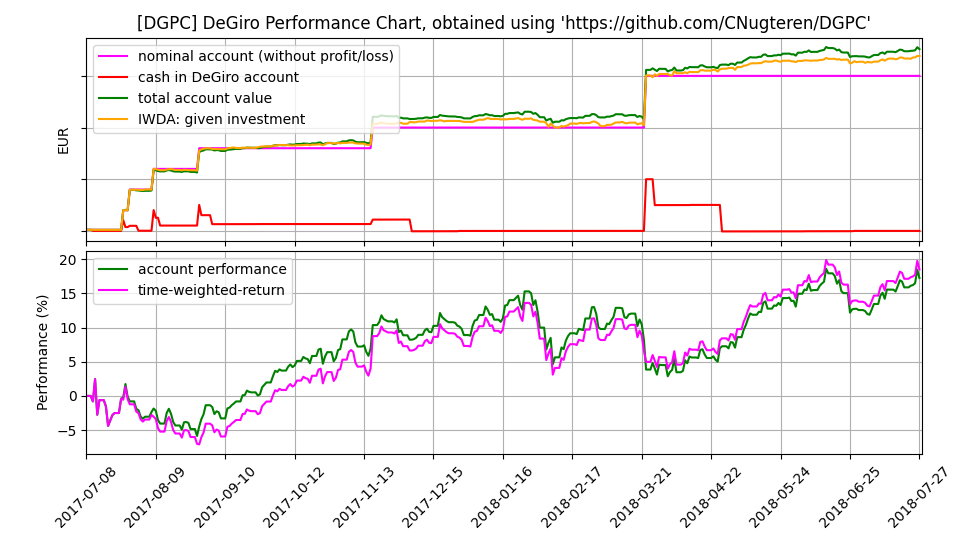

# DGPC: DeGiro Performance Charts

DGPC is a small and simple utility that parses CSV-exports from [DeGiro](degiro.nl) and creates portfolio performance charts, such as the following:

The tool displays:
* In green, the total value of the account, including current stock prices, dividend, fees, cash, etc.
* In magenta, the total investment: money transferred in to the DeGiro account.
* In red, the cash balance: cash on the DeGiro account plus optional 'bank cash' if money is transferred out.
* In orange, a benchmark (default IWDA ETF) assuming all invested money was invested in this instead at time of availability.
* In blue, the same benchmark, but now assuming all available money was invested on day 0.

DGPC is not meant for professional usage and makes many assumptions, can't parse all CSV data (yet), and probably also makes a few mistakes and simplifications here and there. So use it at own risk, feel free to make a pull request to improve the tool.

Stock, ETF, and currency data is queried using the `investpy` package, based on data from [Investing.com](investing.com).

## Requirements

For running the tool itself:
* Python 3.7 or newer
* Several Python packages, run `pip3 install -r requirements.txt` to install

For running the tests and linters, you also need `pytest`, `mypy`, and `pylint`.

## Usage

First you'll need to get an `Account.csv` file:
* Log in to your DeGiro account
* Go to `Overzichten` -> `Rekeningoverzicht`
* Select the **full** date range and select `Export`

Now you can run the tool as follows:

    python3 dgpc.py --input_file /path/to/Account.csv

It will output the graph as `dgpc.png` in your current folder. For more options and configurations, run:

    python3 dgpc.py --help

Current options available in the tool:

      -i INPUT_FILE, --input_file INPUT_FILE
                            Location of DeGiro account CSV file (default: None)
      -p OUTPUT_PNG, --output_png OUTPUT_PNG
                            Path for output PNG image (default: dgpc.png)
      -c OUTPUT_CSV, --output_csv OUTPUT_CSV
                            Path for output CSV file (default: dgpc.csv)
      -e END_DATE, --end_date END_DATE
                            End date for plotting, as DD-MM-YYYY (default: 2020-05-03)
      -s START_DATE, --start_date START_DATE
                            Start date for plotting, as DD-MM-YYYY (default: 2000-01-01)
      -r REFERENCE_ISIN, --reference_isin REFERENCE_ISIN
                            ISIN to plot as reference. By default this is set to IWDA. (default: IE00B4L5Y983)
      -y PNG_HEIGHT_PIXELS, --png_height_pixels PNG_HEIGHT_PIXELS
                            Height of image in pixels, width is determined with the standard 16:9 aspect ratio. (default: 1080)
